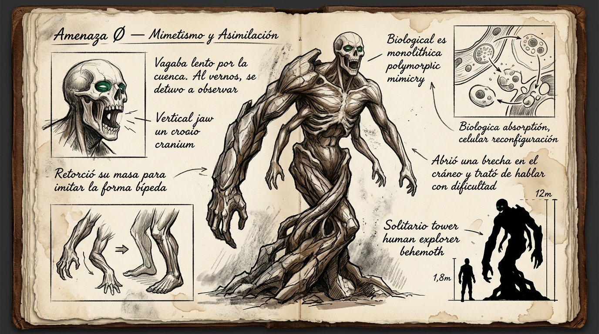

# 🌌 Amenaza Ø (Omega) — Entidad Asimiladora y Polimórfica

---

## 📋 CLASIFICACIÓN Y NATURALEZA DIEGÉTICA

* **Designación oficial (Gobierno en las Sombras):** Amenaza Ø (Omega) — Única entidad biológica cataclísmica registrada en la historia. Clasificación que trasciende la escala estándar de las Vanguardias (superior a cualquier Clase S humana o bestial).
* **Nombre en Lengua Vieja:** *Wiñay Qallariy* («El Inicio Eterno» / «Aquel que Absorbe la Raíz»).
* **Hábitat conocido:** Vaga en aislamiento absoluto a través de cuencas tectónicas desfasadas y valles minerales donde el Flujo ambiental alcanza densidades anómalas.
* **Escala en postura mímica:** 12 a 15 metros de altura al erguirse; masa corporal no calculable debido a su densidad mineral y fluctuación gravitatoria.

---

## 🔬 BIOLOGÍA Y MECÁNICA DE ASIMILACIÓN

### 1. El Pasaje Lento y la Asimilación de Especies
* En soledad, la entidad avanza lentamente por el terreno con la paciencia de un estrato geológico en movimiento. No caza por necesidad calórica ordinaria; su cuerpo absorbe la biomasa vegetal, animal y mineral con la que entra en contacto, integrando el código biológico y las adaptaciones de Flujo de cada especie en su propia carne.
* Su tejido basal es una matriz de músculo negro estriado hiperdenso recubierto por placas de queratina y basalto orgánico que crecen y se fracturan de forma continua.

### 2. Mimetismo Antropomorfo por Contacto
* La forma bipedal y humanoide **no es su estado original**, sino una respuesta directa al contacto con la especie humana:
  * Al divisar a los primeros exploradores (la expedición de élite de Caine), la entidad no embistió como una bestia común: **se detuvo y los observó con curiosidad absoluta**.
  * Tras escanear la anatomía bípeda, retorció su masa inferior en un crujido de tendones y lajas minerales, forzando a su cuerpo a erguirse sobre dos extremidades y moldeando un torso alargado con brazos asimétricos para ponerse a la altura visual de los humanos.

### 3. Comunicación Forzada y Dificultad Vocal
* Al notar que los humanos empleaban el habla, el Omega abrió una hendidura en su cráneo óseo, improvisando una cavidad bucal.
* **El habla:** Intenta comunicarse con dificultad extrema. Carece de cuerdas vocales convencionales; modula el aire y la vibración celular del Flujo a través de cavidades de hueso mineral. Su voz es una superposición de frecuencias graves y crujidos líticos que forman palabras rotas en la Lengua Vieja o fonemas aprendidos de quienes ha observado.
* No ruge; formula preguntas o conceptos fragmentados mientras evalúa la respuesta de los seres frente a él.

---

### 4. Propiedades Espaciales del Tejido (El Origen de las Reliquias)
* La concentración de Flujo en el núcleo del Omega es tan densa que genera micro-colapsos gravitatorios y curvaturas en el espacio local.
* Durante el combate en el que el escuadrón de Caine fue aniquilado, Caine sobrevivió gracias a su *Regeneración de Caudal* continua mientras era atrapado por las extremidades en mutación del titán. Antes de ser arrojado fuera del radio de combate, logró desgajar una lasca fosilizada de su coraza.
* Con este tejido, Caine forjó en secreto absoluto **la pulsera de Leo** y **el collar de Elena**: catalizadores durmientes que conservan la propiedad de plegar el espacio ante una sobrecarga de Flujo (como la que catapultó a Leo a Extramuros en el búnker).

---

## 📖 ROL EN LA NARRATIVA Y PROMESAS DE FUTURO

* **Antecedente:** Motivo del trauma, la deserción y el retiro clandestino de Caine a la ciudad.
* **Proyección futura (Leo Vanes):** Establece las bases para un futuro encuentro en las profundidades de Extramuros donde el Omega no atacará a ciegas: reconocerá la firma genética de Caine en Leo, la resonancia de la reliquia destruida y entablará una comunicación directa que desvelará la verdad sobre la creación de la ciudad y el Velo de Desfase.
