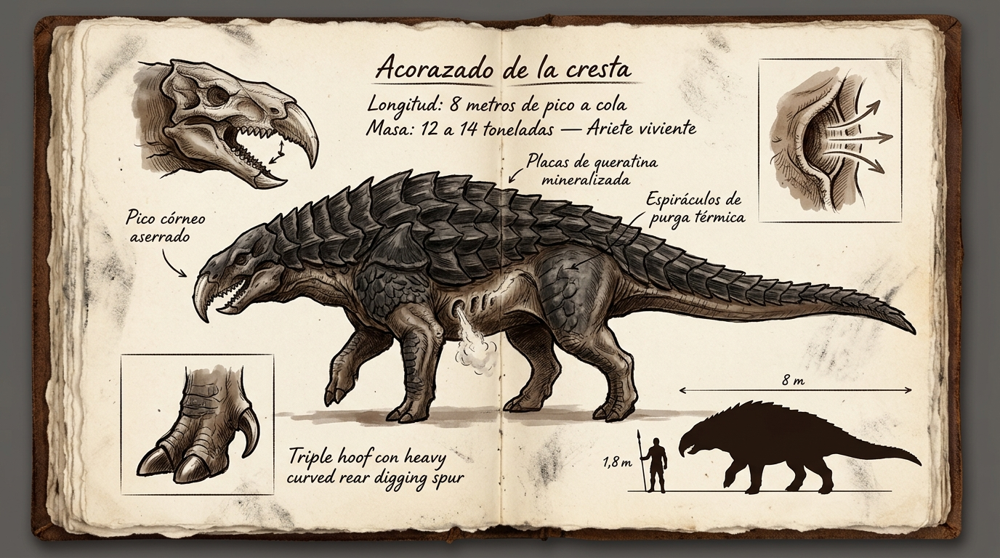

# 🦖 Acorazado de la Cresta (*Q'asa Pirqa*)

---

## 📋 FICHA TÉCNICA Y ECOLÓGICA

* **Nombre común (en la frontera / exilio):** Acorazado de la cresta / Acorazado de la brecha / Ariete de talud.
* **Nombre en Lengua Vieja:** *Q'asa Pirqa* (del quechua: *q'asa*, «brecha o paso entre riscos» + *pirqa*, «muro o pared de roca»). Designa a una mole viva que bloquea o quiebra las hendiduras de piedra.
* **Zona y Bioma:** Zona 1 — *Bosque de los Ecos*, faldas orientales y occidentales de la dorsal de riscos negros basálticos.
* **Tamaño en escala humana:**
  * **Longitud total:** 8 metros de la punta del pico al extremo de la cola.
  * **Anchura de hombros:** 3,2 metros («ancho como dos carromatos de carga pesada»).
  * **Altura a la cruz:** 2,6 – 2,8 metros (vientre muy pegado al terreno).
  * **Masa estimada:** 12 a 14 toneladas.
* **Nicho ecológico:** Depredador de asalto pesado, ariete territorial y carroñero de choque oportunista.

---

## 🔬 ADAPTACIONES BIOLÓGICAS Y DEL FLUJO

### 1. Fisiología y Coraza de Queratina Volcánica
* **Cúpula dorsal:** Cubierta por fajas superpuestas de queratina hipermineralizada con la textura, dureza y densidad de la roca volcánica enfriada al aire. Inmune al fuego convencional de armas portátiles y resistente a derrumbes de cantera.
* **Pliegues de expansión:** Piel cenicienta gruesa entre placas que permite arquear el lomo y absorber la inercia tras impactos de varias toneladas.
* **Extremidades de tracción:** Patas columnares desprovistas de placas para no limitar el rango articular; masa pura de músculo estriado y tendones leñosos. Pezuñas triples con almohadillas amortiguadoras y un espolón óseo curvo posterior que actúa como ancla en el fango y la grava.

### 2. Adaptación de Flujo de Especie: Purga Térmica por Espiráculos
* **Termorregulación forzada:** Genera un incremento metabólico brutal durante las cargas a la carrera. Para no cocer sus órganos vitales, posee una hilera de 4 a 6 orificios ovales a lo largo del costillar bajo, justo bajo el borde de las placas.
* **El Bufido (*Fsssshh...*):** Expulsa chorros de vapor supercaliente a presión cada pocos segundos, liberando temperatura interna y gases gástricos con un hedor característico a carroña tibia, ácidos y grasa mineral rancia.

### 3. Cráneo Ariete y Pico Aserrado
* El cráneo forma un bloque rígido y continuo con la masa cervical y los hombros.
* Termina en un pico córneo curvado hacia abajo con bordes aserrados en sierra leñadora, adaptado para triturar madera fósil, abrir huesos de titanes caídos y fracturar estratos de piedra para alcanzar presas encajonadas.

---

## 👁️ SENTIDOS Y PAUTAS DE CAZA

* **Sentidos dominantes:**
  * **Rastreador térmico:** Detecta fuentes de calor anómalas (impactos cinéticos, fogonazos, combustión de Flujo) a más de un kilómetro.
  * **Olfato:** Atrae de inmediato al animal el olor de carne quemada o sangre fresca.
  * **Visión:** Secundaria. Ojos lechosos bajo prominentes cejas óseas, protegidos por una membrana nictitante traslúcida que se cierra durante las cargas para repeler polvo y esquirlas de roca.
* **Punto ciego y debilidad ecológica:**
  * **Pésimo radio de giro:** Al ser una mole ultracompacta y ancha, es incapaz de doblar en ángulos cerrados. Si falla una embestida, tarda varios segundos en desacelerar y rotar.
  * **Vulnerabilidad durante la purga:** Los pliegues blandos de los espiráculos quedan expuestos y sin blindaje en el instante exacto en que se abren para soltar vapor.
  * **Incompatibilidad con espacios angostos:** Su anchura de carromato le impide franquear fisuras o galerías de menos de dos metros de luz.
* **Reacción al Pozo Muerto:**
  * Rehúye el perímetro de Quietud de la cabaña de Mason; la desaceleración metabólica inducida paraliza sus espiráculos, amenazándolo con asfixia térmica.

---

## 📖 APARICIÓN EN LA NOVELA

* **Capítulo 2:** *«La Brecha de Basalto»*.
* **Función narrativa:** Es el primer contacto de Leo con la biología extrema y hostil de Extramuros. Obliga a Leo a una persecución agónica por el cráter y el sotobosque, acorralándolo en la Cueva de los Huesos y provocando la primera activación convulsiva e involuntaria de su Flujo para escalar la sima y salvar la vida.
