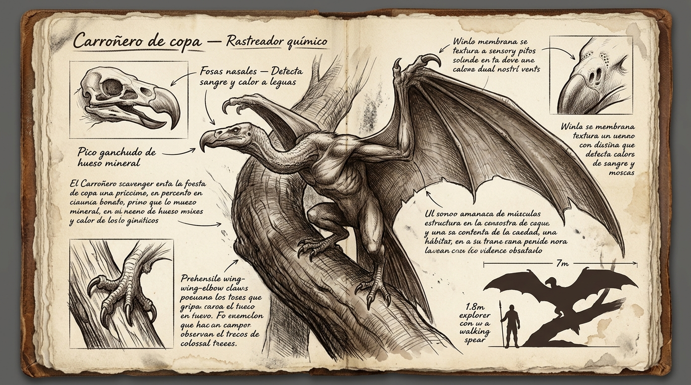

# 🦅 Carroñero de Copa (*Suyuntuy*)

---

## 📋 FICHA TÉCNICA Y ECOLÓGICA

* **Nombre común (en la frontera / exilio):** Carroñero de copa / «El que espera» / Buitre del dosel.
* **Nombre en Lengua Vieja:** *Suyuntuy* (del quechua: carroñero mayor que acecha desde las alturas).
* **Zona y Bioma:** Zona 1 — *Bosque de los Ecos*, estrato medio y alto del dosel de árboles titánicos.
* **Tamaño en escala humana:**
  * **Envergadura alar:** 7 a 8 metros de punta a punta de ala (equivalente a cuatro hombres extendidos).
  * **Longitud corporal:** 3,2 metros de pico a cola.
  * **Masa estimada:** 400 a 600 kg (cuerpo ligero y musculoso, similar a un toro joven pero con huesos huecos reforzados con trabéculas de cal mineral).
* **Nicho ecológico:** Carroñero oportunista de altura y depredador rematador de presas heridas o sobrecalentadas por el Flujo.

---

## 🔬 ADAPTACIONES BIOLÓGICAS Y DEL FLUJO

### 1. Fisiología y Membranas Alares de Escalada
* **Alas coriáceas mixtas:** Membrana de cuero grueso sin plumas verdaderas, similar a un quiróptero titánico, reforzada con quillas córneas que resisten las ramas duras del dosel.
* **Garras en codos alares (*wing-elbow claws*):** Falanges articuladas en la articulación del ala que le permiten trepar por la corteza cilíndrica vertical de los árboles monumentales sin necesidad de alzar el vuelo.
* **Patas prensiles:** Garras posteriores curvadas de hueso denso que se clavan en la madera viva para perchas de reposo prolongadas.

### 2. Adaptación de Flujo de Especie: Percepción Química y Térmica de Caudal
* **Fosas olfativas hipertrofiadas:** Cavidades nasales dobles y sensores químicos situados sobre la base del pico, capaces de captar a varios kilómetros de distancia el sudor cargado de Flujo, el ácido láctico y el calor residual de un cuerpo humano o animal forzando el Caudal.
* **Acecho pasivo:** No gasta energía persiguiendo presas sanas; vuela en corrientes térmicas altas o permanece agazapado en el follaje esperando a que el colapso metabólico post-Flujo (la hipoglucemia y los calambres) inmovilice a su víctima.

### 3. Pico Ganchudo de Hueso Mineral
* Cráneo aviar alargado con cuello desprovisto de plumas para evitar acumulaciones de sangre coagulada al alimentarse.
* Pico ganchudo masivo de hueso mineralizado diseñado para rasgar tendones gruesos, perforar piel endurecida y quebrar articulaciones secas de animales de gran tamaño.

---

## 👁️ COMPORTAMIENTO Y SUPERVIVENCIA

* **Punto ciego y debilidad ecológica:**
  * **No desciende si la presa camina con ritmo constante:** Su instinto le dicta evitar el suelo mientras la presa mantenga una zancada firme; solo cae en picado cuando la víctima se desploma o reduce drásticamente el pulso.
  * **Vulnerabilidad en despegue terrestre:** En el suelo es torpe y necesita varios metros de carrera o trepar a un tronco alto para relanzarse al aire.
* **Reacción al Pozo Muerto:**
  * Rodea el perímetro de Quietud a gran distancia; la ausencia absoluta de actividad metabólica y el letargo le provocan rechazo instintivo.
* **Regla de supervivencia de los veteranos:**
  * *«Si estás herido o has quemado tus reservas en Caudal, no te detengas a descansar a cielo abierto: sigue caminando despacio o busca un techo de roca viva antes de que bajen del dosel.»*

---

## 📖 ROL EN LA NARRATIVA

* **Nodo 1.2 del Roadmap:** Aparece en las inmediaciones del Bosque de los Ecos durante el adiestramiento con Mason.
* **Función pedagógica:** Demuestra de manera visceral a Leo que usar el poder en Extramuros no es gratis ni invisible: el Caudal genera una firma térmica y química que atrae a los carroñeros del exterior, justificando por qué Mason le exige aprender la **Quietud**.
