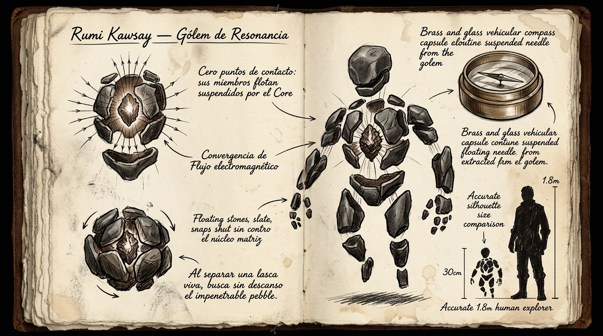

# 🪨 Gólem de Resonancia (*Rumi Kawsay*)

---

## 📋 FICHA TÉCNICA Y ECOLÓGICA

* **Nombre común (en la frontera / convoyes):** Gólem de brújula / Gólem de resonancia / Micro-gólem mineral.
* **Nombre en Lengua Vieja:** *Rumi Kawsay* (del quechua: *rumi*, «piedra/roca» + *kawsay*, «vida / aliento vital»).
* **Zona y Bioma:** Zona 1 y periferia de fallas tectónicas; grietas de andesita y canteras minerales con alta concentración de Flujo residual.
* **Tamaño en escala humana:**
  * **Altura erguido:** 25 a 35 centímetros.
  * **Masa corporal:** 4 a 7 kg (densidad de andesita y magnetita).
* **Nicho ecológico:** Fauna lítica endémica pasiva; filtrador de resonancia electromagnética y Flujo ambiental mineralizado.

---

## 🔬 BIOMECÁNICA: ANATOMÍA DE PIEZAS SUSPENDIDAS

### 1. Cero Puntos de Unión Física
* El *Rumi Kawsay* carece por completo de articulaciones, cartílagos, huesos o ligamentos de unión.
* Sus extremidades (manos de cinco dedos de piedra, antebrazos, hombreras, placas de torso, pelvis y piernas) son bloques independientes de andesita pulida que **flotan en el aire** a milímetros de separación unos de otros.

### 2. El Core como Centro de Convergencia
* En el centro de su pecho flota su **órgano vital primario (el Core)**: un nódulo mineral facetado y translúcido que emite un pulso electromagnético continuo potenciado por Flujo.
* Todas las piezas de su cuerpo se mantienen unidas y se articulan gracias a que **las líneas de atracción invisibles convergen de manera constante en el Core**.
* **Modo defensivo:** Ante un peligro, el animal contrae su campo y las piezas flotantes se cierran de golpe sobre el Core en un chasquido seco, formando un canto rodado impenetrable y liso que rueda por el suelo.

---

## 🧭 LA BRÚJULA DE AFINIDAD Y EL SISTEMA DE VEHÍCULOS

* **La física del enlace biológico:** Si una lasca o aguja viva es extraída de las extremidades del gólem y encapsulada en una ampolla de aceite denso dentro de una brújula de bronce, **la pieza conserva la memoria física del campo de convergencia**. La aguja apunta con fuerza física inmutable hacia el Core matriz del animal, independientemente de la distancia o las interferencias de la selva.
* **Uso en convoyes:**
  * En Puerto Raíz y en los vehículos nodriza de las expediciones viajan los Cores matrices vivos dentro de jaulas acolchadas.
  * Los vehículos pesados y los *Wayra* montan brújulas sintonizadas a dichos Cores en un tambor rotatorio en el salpicadero, seleccionables mediante una palanca vertical de trinquete (*mecanismo de tragaperras*).
